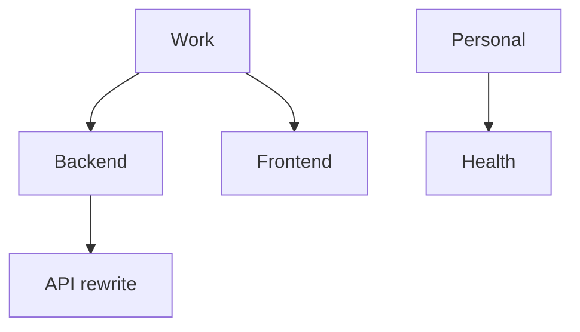

# Project

מיכל ל-[[Task|משימות]]. תומך בהיררכיה (parent/children) עד 3 רמות.

> [!info] קובץ
> `prisma/schema.prisma` (Project model)  ·  actions ב-`src/lib/actions/projects.ts`

## שדות

| שדה | טיפוס | הערה |
|---|---|---|
| `id` | `String` cuid | PK |
| `name` | `String` | חובה |
| `color` | `String` | HEX, default `#4FD2D4` (cyan) |
| `icon` | `String?` | אמוג׳י עד 8 תווים |
| `parentId` | `String?` | self-FK |
| `position` | `Int` | סדר ב-sidebar |
| `isArchived` | `Boolean` | default `false` |
| `archivedAt` | `DateTime?` | מתי ארכובו |
| `deletedAt` | `DateTime?` | [[Soft Delete]] |

## היררכיה



> [!warning] MAX_DEPTH = 3
> `createProject` בודק עומק ההורה ב-`depthOf()`. ניסיון להוסיף ילד מתחת לשלוש רמות → `Error('עומק היררכיה מקסימלי הוא 3 רמות')`. PRD §4.2.

## Indexes

```prisma
@@index([parentId])
@@index([isArchived, deletedAt])  // מהיר לטעינת sidebar
```

## Validation

`src/lib/validators/project.ts`:

> [!example] projectCreateSchema
> - `name`: trim, min 1 (`'יש להזין שם'`), max 120
> - `color`: regex HEX (`#RGB` או `#RRGGBB`) — ערכים לא חוקיים → `'צבע HEX לא תקין'`
> - `icon`: trim, max 8 תווים (אמוג׳י)
> - `parentId`: cuid אופציונלי

> [!tip] PROJECT_COLOR_PRESETS
> 8 צבעים מוכנים מ-PRD §5.1: magenta, cyan, yellow, muted, purple, green, orange, red.

## Actions

| Action | התנהגות מיוחדת |
|---|---|
| `createProject` | בודק `MAX_DEPTH` |
| `updateProject` | חוסם `parentId === id` (`'פרויקט לא יכול להיות הורה של עצמו'`) |
| `archiveProject` | מגדיר `isArchived=true` + `archivedAt=now()`, **בלי [[TaskEvent]]** |
| `softDeleteProject` | חוסם אם יש משימות פעילות (`status != DONE && deletedAt = null`) |

> [!info] Pattern B
> ל-Project אין audit log. ההבחנה הזו בין Pattern A (Task, עם TaskEvent) ל-Pattern B (Project, בלי) היא מהותית ל-[[Server Actions Pattern]].

ראה גם: [[Task]] · [[Server Actions Pattern]] · [[Soft Delete]]
