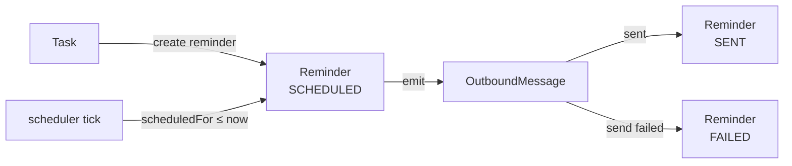

# Reminder

תזכורת על [[Task]] — נשלחת דרך WhatsApp ([[OutboundMessage]]) ב-scheduler כל 5 דקות.

> [!success] מומש
> Wave B השלים את ה-implementation: scheduler cron, `runReminderSweep()`, integration עם tasks.ts helpers.

## שדות

| שדה | טיפוס | הערה |
|---|---|---|
| `id` | `String` cuid | |
| `taskId` | `String` | FK ל-[[Task]], cascade |
| `type` | `ReminderType` enum | `BEFORE_DUE` / `AT_TIME` / `DAILY_DIGEST` |
| `channel` | `ReminderChannel` enum | `WHATSAPP` (default) / `IN_APP` |
| `offsetMinutes` | `Int?` | רק אם `type=BEFORE_DUE` (למשל 30 = 30 דקות לפני) |
| `absoluteTime` | `String?` | `"HH:mm"` ל-`type=AT_TIME` או `DAILY_DIGEST` |
| `scheduledFor` | `DateTime?` | מחושב — מתי בדיוק לשלוח |
| `status` | `ReminderStatus` enum | `SCHEDULED` / `SENT` / `FAILED` / `CANCELLED` |
| `sentAt` | `DateTime?` | |

## זרימה מתוכננת



## Indexes

```prisma
@@index([scheduledFor, status])  // השאילתה הקריטית של ה-scheduler
@@index([taskId])
```

> [!tip] השאילתה הקריטית
> ```sql
> WHERE status = 'SCHEDULED' AND scheduledFor <= NOW()
> ```
> האינדקס הזה הופך אותה ל-O(log n).

## תכנון

ראה [[Roadmap#Phase 2 — WhatsApp Integration (תכנון)]] להחלטה הפתוחה לגבי ה-scheduler:
- Vercel Cron Jobs (פשוט אם פורסים שם)
- `node-cron` בתוך השרת (לא רץ ב-serverless)
- Queue חיצוני (Inngest / Trigger.dev)

ראה גם: [[Task]] · [[OutboundMessage]] · [[Roadmap]]
