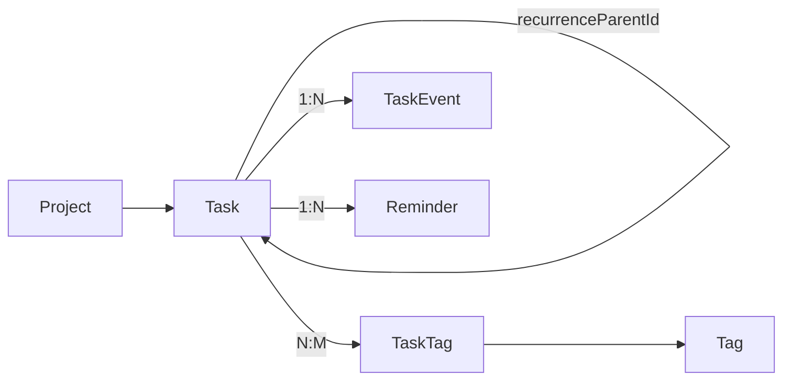

# Task

המודל המרכזי במערכת. כל פעולה במערכת בסופו של דבר מתורגמת לשינוי על Task.

> [!info] קובץ
> `prisma/schema.prisma` (Task model)  ·  גישה דרך [[Server Actions Pattern|server actions]] ב-`src/lib/actions/tasks.ts`

## שדות עיקריים

| שדה | טיפוס | הערה |
|---|---|---|
| `id` | `String` cuid | PK |
| `title` | `String` | חובה. max 500 תווים ([[#Validation]]) |
| `description` | `String?` | אופציונלי, max 10,000 |
| `status` | `TaskStatus` enum | `OPEN` / `IN_PROGRESS` / `WAITING` / `DONE` / `CANCELLED` |
| `priority` | `TaskPriority` enum | `P1` (דחוף) → `P4` (נמוך). default `P4` |
| `dueDate` | `DateTime?` | תאריך יעד |
| `dueHasTime` | `Boolean` | האם יש שעה (לעומת תאריך בלבד) |
| `startDate` | `DateTime?` | מתי להתחיל |
| `completedAt` | `DateTime?` | מתי סומנה DONE |
| `estimatedMinutes` | `Int?` | אומדן זמן |
| `position` | `Int` | סדר בתוך תצוגה |

## Soft delete & archive

| שדה | משמעות |
|---|---|
| `deletedAt` | [[Soft Delete]] — null = חיה |
| `archivedAt` | "ארכוב" — מסתירה מתצוגות אבל לא מוחקת |

> [!warning] תמיד לסנן
> ```ts
> where: { deletedAt: null, archivedAt: null }
> ```

## קשרים



| קשר | יעד | תיאור |
|---|---|---|
| `project` | [[Project]] | אופציונלי |
| `parentTask` / `subtasks` | Task | תתי-משימות (UI עוד לא מומש) |
| `tags` | [[TaskTag]] → [[Tag]] | M:N |
| `events` | [[TaskEvent]] | [[Audit Log]] |
| `reminders` | [[Reminder]] | Phase 2 |
| `outboundMessages` | [[OutboundMessage]] | Phase 2 |
| `recurrenceParent` | Task | חזרתיות (UI עוד לא מומש) |

## Indexes

```prisma
@@index([status, dueDate])      // queries של "פתוחות עם dueDate"
@@index([projectId, status])    // משימות בפרויקט לפי סטטוס
@@index([parentTaskId])         // sub-tasks lookup
@@index([deletedAt])            // soft-delete filter
@@index([archivedAt])
@@index([recurrenceParentId])
```

## Validation

ב-`src/lib/validators/task.ts`:

> [!example] taskCreateSchema
> - `title`: trim, min 1 (`'יש להזין כותרת'`), max 500 (`'כותרת ארוכה מדי'`)
> - `description`: trim, max 10,000, ריק → `undefined`
> - `dueDate` / `startDate`: ISO string, חייב להיפרסר ע"י `Date.parse` (`'תאריך לא תקין'`)
> - `estimatedMinutes`: `z.coerce.number().int().positive().optional()`
> - `taskUpdateSchema = taskCreateSchema.partial()`

## Actions

7 actions תחת `src/lib/actions/tasks.ts`:

| Action | סוג | TaskEvent שנוצר |
|---|---|---|
| `createTask` | יצירה | `CREATED` |
| `updateTask` | עדכון | `STATUS_CHANGED` (אם status השתנה) + `UPDATED` per logged field |
| `completeTask` | shortcut | `COMPLETED` |
| `reopenTask` | shortcut | `REOPENED` |
| `archiveTask` | ארכוב | `ARCHIVED` |
| `restoreTask` | שחזור מארכיון | `RESTORED` |
| `softDeleteTask` | מחיקה רכה | `DELETED` |

> [!important] LOGGED_FIELDS
> רק שינוי באחד מהם יוצר `UPDATED` event:
> ```ts
> const LOGGED_FIELDS = ['title', 'description', 'dueDate', 'startDate', 'priority', 'projectId']
> ```
> שינוי `status` מקבל event ייעודי `STATUS_CHANGED` (לא `UPDATED`) — PRD §4.10.

ראה גם: [[Server Actions Pattern]] · [[Audit Log]] · [[All]]
