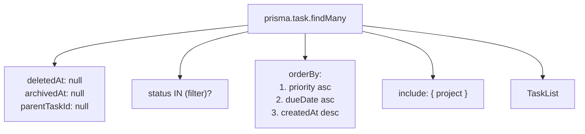

# All — הכל

תצוגה ראשית: כל המשימות החיות, עם סינון לפי [[Task#שדות עיקריים|status]].

> [!info] קובץ
> `src/app/(views)/all/page.tsx`  ·  ראוט: `/all`  ·  גם ה-redirect מ-`/`

> [!note] Route Group
> נמצא תחת `(views)` — route group של Next.js. הסוגריים נעלמים מה-URL, אז הראוט בפועל הוא `/all`.

## מה היא מציגה



> [!important] רק top-level
> `parentTaskId: null` — תתי-משימות לא מופיעות ברשימה הראשית. ייכנסו ל-UI כשנוסיף תצוגה היררכית.

## Status filter

נטען מ-URL search params (`?status=OPEN,IN_PROGRESS`):

```ts
function parseStatuses(raw: string | string[] | undefined): TaskStatusValue[]
```

- `parseStatuses` בודק שכל ערך עובר `TaskStatusEnum.safeParse` (ראה [[Task#Validation]])
- ריק → לא מסנן (מציג הכל)

הרכיב: [[StatusFilter|`StatusFilter`]] (ב-`src/components/views/StatusFilter.tsx`).

## נתונים נטענים

| משאב | טעון מ | תפקיד |
|---|---|---|
| משימות | `prisma.task.findMany` | רשימת המשימות |
| פרויקטים | `prisma.project.findMany` | dropdown ב-[[#Create dialog]] |

> [!tip] Promise.all
> שתי השאילתות רצות במקביל — מקצרות TTFB.

## Create dialog

`<TaskCreateDialog projects={projects} />` בראש הדף. פותח דיאלוג עם [[Task#Validation|`taskCreateSchema`]].

ראה גם: [[Server Actions Pattern]] · [[Inbox]] · [[Today]] · [[Week]]
