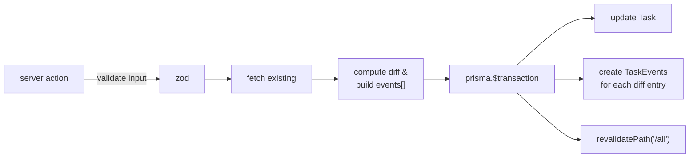

# Audit Log

לוג בלתי-משתנה של כל שינוי ב-[[Task]]. הלב: מודל [[TaskEvent]].

> [!important] מקיף עבור Task — לא עבור Project
> כל פעולה על [[Task]] רושמת לפחות [[TaskEvent]] אחד. [[Project]] לעומת זאת לא נכתב לאודיט (Pattern B).

## עקרונות

1. **Immutable** — TaskEvent לא נערך ולא נמחק. כל שינוי = event חדש.
2. **בתוך transaction** — אם ה-update נכשל, ה-event לא נכתב. אם ה-event נכשל, ה-update מתבטל.
3. **Payload כ-JSON string** — עמיד לשינויי schema, מאפשר diff ישיר.

## הזרימה הסטנדרטית



## מיפוי action → event

| Action | סוג event | מתי |
|---|---|---|
| `createTask` | `CREATED` | תמיד |
| `updateTask` | `STATUS_CHANGED` | אם `status` השתנה |
| `updateTask` | `UPDATED` (אחד per שדה) | אם שדה ב-`LOGGED_FIELDS` השתנה |
| `completeTask` | `COMPLETED` | אם status היה ≠ DONE |
| `reopenTask` | `REOPENED` | אם status היה DONE |
| `archiveTask` | `ARCHIVED` | אם `archivedAt` היה null |
| `restoreTask` | `RESTORED` | אם `archivedAt` היה מאוכלס |
| `softDeleteTask` | `DELETED` | תמיד (אם הרשומה קיימת) |

> [!info] LOGGED_FIELDS
> `['title', 'description', 'dueDate', 'startDate', 'priority', 'projectId']` — שדות אחרים (`dueHasTime`, `estimatedMinutes`) משתנים בלי event.

## דוגמת payload

> [!example] עדכון dueDate
> ```json
> {
>   "field": "dueDate",
>   "from": "2026-05-10T00:00:00.000Z",
>   "to": "2026-05-12T00:00:00.000Z"
> }
> ```

> [!example] שינוי status (event נפרד)
> ```json
> { "field": "status", "from": "OPEN", "to": "IN_PROGRESS" }
> ```

## Actor

```ts
enum EventActor {
  USER       // פעולה ידנית של המשתמש (Phase 1 — תמיד זה)
  SYSTEM     // job אוטומטי (recurrence rollover, וכו')
  WHATSAPP   // נכנס דרך InboundMessage (Phase 2)
}
```

ב-Phase 1 כל ה-events נכתבים עם `actor: 'USER'`. ב-Phase 2 פקודות וואטסאפ ייצרו events עם `actor: 'WHATSAPP'`.

## למה לא event sourcing מלא

> [!info] החלטה מודעת
> ה-Task עצמו הוא ה-source of truth. ה-events הם רק לוג נצבר ל-UI ולדיבוג. שחזור Task משרשרת events לא נדרש (וגם לא נתמך — חלק מהשדות לא נכנסים ל-`LOGGED_FIELDS`).

ראה גם: [[TaskEvent]] · [[Server Actions Pattern]] · [[Soft Delete]]
