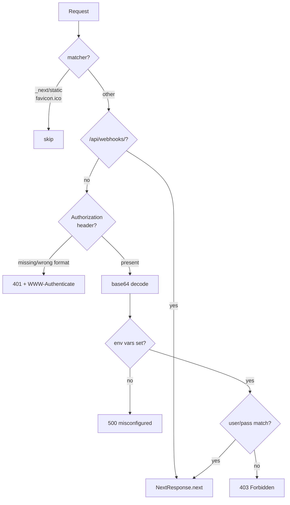

# Authentication

Basic Auth single-user. אין user table, אין session, אין JWT.

> [!info] קובץ
> `src/proxy.ts` — לא `middleware.ts` (Next.js 16 שינה את השם)

> [!important] Next.js 16
> מה שהיה `middleware.ts` בגרסאות קודמות עכשיו `proxy.ts`. ה-export בפנים: `export function proxy(req)`. רץ ב-Node.js runtime כדיפולט.

## הזרימה



## env vars

```
BASIC_AUTH_USER=...
BASIC_AUTH_PASS=...
```

> [!warning] חסר → 500
> אם אחד מהם לא מוגדר, ה-proxy מחזיר `'Server misconfigured: BASIC_AUTH_USER/PASS missing'`. **לא נופל לערכים חיצוניים** — זה מודע, להגנה מפני misconfiguration שקטה.

## ה-bypass של webhooks

```ts
if (req.nextUrl.pathname.startsWith('/api/webhooks/')) {
  return NextResponse.next()
}
```

> [!important] Phase 2
> Green API שולח webhooks בלי Basic Auth. ה-bypass הוא הכרחי. בעתיד — לא מסתפקים בזה: handlers של webhook חייבים לאמת חתימה (HMAC) של Green API. זה תפקיד ה-`green-api-integrator` subagent העתידי.

## matcher

```ts
matcher: ['/((?!_next/static|_next/image|favicon.ico).*)']
```

קבצי static של Next ו-favicon לא מאומתים — אין מה להחביא שם.

## מגבלות

> [!warning] לפרודקשן בודד
> זה מספיק כי המערכת single-user. **אין לפרוס multi-tenant ככה**. אין rate-limit, אין lockout אחרי כשלונות, סיסמה ב-env (לא hashed).

> [!tip] HTTPS חובה
> Basic Auth שולחת את הסיסמה בכל request כ-base64. ב-HTTP פתוח זה כמו שליחה ב-clear text. כל deployment חייב להיות מאחורי TLS.

ראה גם: [[Roadmap]] · [[InboundMessage]] · [[Tech Stack]]
