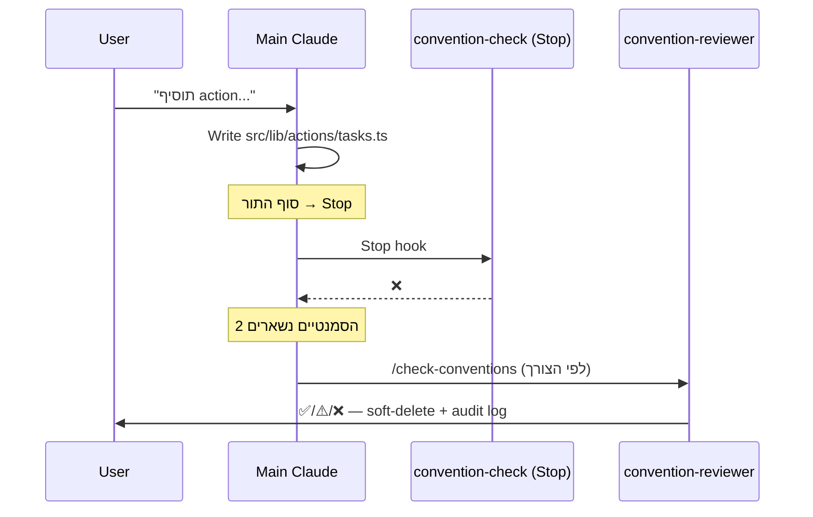

# Convention Check Hook

`Stop` hook (advisory, **לא חוסם**) שסורק **סטטית** את `src/lib/actions/` ו-`src/lib/validators/` ומדווח על הפרות של 3 ה-invariants ה**דטרמיניסטיים** בלבד. מייתר את הצורך להריץ את [[convention-reviewer]] עבור בדיקות מכניות — הסוכן מתמקד ב-2 ה-invariants הסמנטיים.

> [!warning] הפרויקט אינו git repo
> אין `git diff` לסרוק מולו. ה-hook סורק את שתי התיקיות סטטית בכל Stop. שקט לחלוטין כשאין הפרות.

> [!info] קבצים
> `.claude/hooks/convention-check.js` — הסקריפט עצמו
> `.claude/settings.json` — רשום ב-`Stop` ✅ פעיל
> `.claude/commands/check-conventions.md` — command `/check-conventions` להפעלת הסקירה המלאה ידנית

## מה הוא בודק

| # | Invariant | בדיקה |
|---|---|---|
| 4 | `'use server'` בשורה הראשונה של כל קובץ ב-`src/lib/actions/` | השורה הלא-ריקה הראשונה == `'use server'` |
| 5 | Path alias — אין import יחסי ב-`actions/`+`validators/` | regex על `from '../'` / `from './'` (צריך `@/`) |
| 3 | [[Hebrew Errors]] — אין `throw new Error('<אנגלית>')` | המחרוזת מתחילה באות לטינית → דגל |

> [!tip] חלוקת אחריויות
> ה-hook: דטרמיניסטי, מהיר, שקט אם נקי. ה-subagent [[convention-reviewer]]: סמנטי בלבד — #1 נכונות פילטר [[Soft Delete]] ו-#2 שלמות ה-[[Audit Log]] (סוג ה-`TaskEvent` הנכון). אלו דורשים הבנה, לא grep.

## פלט

מדפיס רק אם נמצאו הפרות (אחרת — שקט, exit 0):

```jsonc
{
  "systemMessage": "⚠️ convention-check — N violation(s) in src/lib/",
  "hookSpecificOutput": {
    "hookEventName": "Stop",
    "additionalContext": "convention-check found N deterministic ... \n  • #4 'use server' — src/lib/actions/foo.ts:1 — missing/not-first-line directive\n  • #3 Hebrew errors — ...: English error string: \"...\""
  }
}
```

> [!info] שגיאות שקטות
> כל הסקריפט עטוף ב-`try { } catch {}` ריק — *"hooks must never break the user's flow"*. נכשל בשקט.

## תיזמון מול הזרימה



## הגדרות

> [!success] ✅ רשום ופעיל
> אושר ע"י המשתמש ונרשם ב-`.claude/settings.json` תחת `hooks.Stop`:

```json
"Stop": [
  {
    "hooks": [
      {
        "type": "command",
        "command": "node .claude/hooks/convention-check.js",
        "timeout": 5,
        "statusMessage": "Checking conventions"
      }
    ]
  }
]
```

> [!warning] timeout 5 שניות
> אם הסקריפט תקוע >5ש' → Claude עוצר רגיל בלי הקלט. הסריקה (readdir + readFile + regex על שתי תיקיות קטנות) לא אמורה להגיע לשם.

## הבעיה שזה פותר

> [!quote] לפני
> *"כל בדיקת מוסכמות = spinning של סוכן שלם בשביל 5 greps. יקר ואיטי לבדיקות שהן regex חד-משמעי."*

> [!success] אחרי
> 3 הבדיקות המכניות רצות בחינם בכל Stop; [[convention-reviewer]] נשמר רק ל-2 ההחלטות הסמנטיות שבהן יש לו ערך אמיתי.

ראה גם: [[Subagents]] · [[convention-reviewer]] · [[Vault Sync Hook]] · [[Conventions]]
