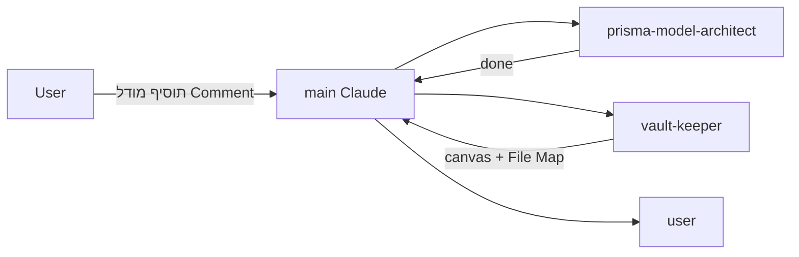

# Subagents

חמישה subagents ייעודיים תחת `.claude/agents/`. כל אחד מצומצם לאחריות אחת.

> [!important] לא לבקש מסוכן אחד את העבודה של אחר
> אם הסוכן הלא נכון מקבל את הבקשה, הוא יבצע אותה גרוע. אם לא ברור — main Claude מחליט.

## חמשת הסוכנים

ה-`description` של כל סוכן מקוצר לדוגמה אחת מייצגת — חיסכון הקשר קבוע בכל סשן.

| Agent | אחריות | מתי להפעיל |
|---|---|---|
| [[server-action-builder]] | לבנות action חדש ב-`src/lib/actions/` עם כל ה-Patterns | "תוסיף action ש..." / mutation חדשה |
| [[prisma-model-architect]] | End-to-end למודל חדש: schema + migration + validator + action stubs + vault note | "תוסיף מודל..." / טבלה חדשה |
| [[view-builder]] | דף read-only ב-`src/app/(views)/` — Server Component, קריאות Prisma מקבילות עם soft-delete, סריאליזציית `Date`→ISO | "תבנה את תצוגת..." / דף route חדש |
| [[convention-reviewer]] | Code review **סמנטי** — 2 invariants עיקריים (soft delete, audit log). 3 הדטרמיניסטיים מסוננים מראש ע"י [[Convention Check Hook]] | אחרי כל feature שנוגעת ב-`src/lib/` |
| [[vault-keeper]] | מעדכן את `vault/` (notes, canvas, File Map) | אחרי שינוי ארכיטקטוני / view / רכיב חדש |

## Chaining

ב-Claude Code subagents לא קוראים זה לזה ישירות — main Claude מתאם.

> [!example] חוקי chaining מוסכמים
> 1. אחרי [[prisma-model-architect]] או [[view-builder]] **תמיד** להפעיל [[vault-keeper]]
> 2. אחרי שינוי ב-`src/lib/actions/` מומלץ [[convention-reviewer]] (או הפקודה `/check-conventions`)
> 3. אחרי [[server-action-builder]] לעיתים [[vault-keeper]] (אם זה action שמופיע ב-canvas)

## Hooks אוטומטיים

- [[Vault Sync Hook]] — PostToolUse; אחרי Write/Edit על קובץ ארכיטקטוני זורק תזכורת ל-main Claude להפעיל [[vault-keeper]]. תזכורת בלבד, לא בקרה.
- [[Convention Check Hook]] — Stop (advisory); סורק סטטית את `src/lib/actions/`+`src/lib/validators/` ל-3 ה-invariants הדטרמיניסטיים. רשום ופעיל ב-`.claude/settings.json`.

## פקודות

- `/check-conventions` (`.claude/commands/check-conventions.md`) — מפעיל את [[convention-reviewer]] עם scope לקבצים האחרונים ב-`src/lib/` (סקירה מלאה ידנית; הפרויקט אינו git repo אז אין scope לפי `git diff`).

## Subagents עתידיים (Phase 2)

> [!todo] ייכתבו ב-Phase 2
> - **`green-api-integrator`** — לקוח HTTP ל-Green API, webhook handlers, אימות חתימות, פיענוח פקודות תשובה (`done`/`snooze`/`delete`), מיפוי ל-[[OutboundMessage]]/[[InboundMessage]]. מכיר את ה-bypass ב-[[Authentication|`proxy.ts`]].
> - **`reminder-scheduler-designer`** — worker שסורק [[Reminder]] לפי `scheduledFor`, יוצר [[OutboundMessage]], ומתחבר ל-`green-api-integrator`. החלטה פתוחה: Vercel cron / `node-cron` / queue חיצוני.

ראה גם: [[Vault Sync Hook]] · [[Roadmap]]
