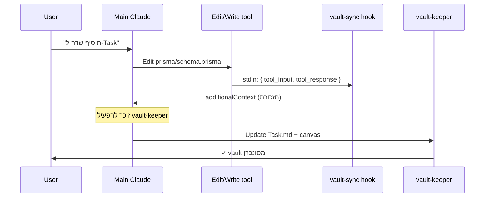

# Vault Sync Hook

PostToolUse hook שרץ אחרי כל `Write`/`Edit` על קבצי קוד ארכיטקטוניים. שותל ל-context תזכורת ל-main Claude להפעיל את [[vault-keeper]]. שקט עבור עריכות לא רלוונטיות.

> [!info] קבצים
> `.claude/settings.json` — רישום ה-hook
> `.claude/hooks/vault-sync-reminder.js` — הסקריפט עצמו

## מה הוא בודק

```js
const triggers = [
  { pattern: /\/src\/lib\/actions\//,      kind: 'server action' },
  { pattern: /\/src\/lib\/validators\//,   kind: 'Zod validator' },
  { pattern: /\/src\/app\/.*page\.tsx$/,   kind: 'view (route page)' },
  { pattern: /\/src\/components\/(?!ui\/)/, kind: 'component' },
  { pattern: /\/prisma\/schema\.prisma$/,  kind: 'Prisma schema' },
  { pattern: /\/\.claude\/agents\//,       kind: 'subagent definition' },
  { pattern: /\/\.claude\/hooks\//,        kind: 'hook script' },
  { pattern: /\/\.claude\/settings\.json$/, kind: 'Claude settings' },
]
```

> [!tip] חזית רחבה
> ה-hook מנטר גם את עצמו (`.claude/hooks/`) ואת הסוכנים. שינוי בסוכן = משהו ארכיטקטוני, צריך לעדכן את [[Subagents]].

## פלט

```jsonc
{
  "systemMessage": "🔔 vault-sync check — server action",
  "hookSpecificOutput": {
    "hookEventName": "PostToolUse",
    "additionalContext": "vault-sync: server action was modified (src/lib/actions/tasks.ts). If this is an architectural change... invoke the vault-keeper agent..."
  }
}
```

## כשולא רלוונטי

> [!info] שגיאות שקטות
> ה-hook עטוף ב-`try { } catch {}` ריק — *"hooks must never break the user's flow"*. אם משהו נשבר (JSON malformed, permission), פשוט לא נורה. לא נשלח שגיאה למשתמש.

## תיזמון מול הזרימה



## הגדרות

```json
{
  "hooks": {
    "PostToolUse": [
      {
        "matcher": "Write|Edit",
        "hooks": [
          {
            "type": "command",
            "command": "node .claude/hooks/vault-sync-reminder.js",
            "timeout": 5,
            "statusMessage": "Checking vault sync"
          }
        ]
      }
    ]
  }
}
```

> [!warning] timeout 5 שניות
> אם הסקריפט תקוע יותר מ-5 שניות → Claude ממשיך בלי הקלט שלו. ה-script פשוט (קריאת stdin + regex match) ולא צריך להגיע לשם.

## הבעיה הקלאסית שזה פותר

> [!quote] לפני ה-hook
> *"שיניתי את ה-schema, אבל שכחתי לעדכן את `Task.md`. השכחה הזו מצטברת — בעוד שבועיים ה-vault מסונכרן באופן חלקי בלבד."*

> [!success] אחרי ה-hook
> בכל שינוי רלוונטי, ל-Claude יש תזכורת בהקשר. נשארת ההחלטה (האם זה refactor פנימי שלא משפיע, או שינוי ארכיטקטוני אמיתי).

ראה גם: [[Subagents]] · [[vault-keeper]] · [[Conventions]]
