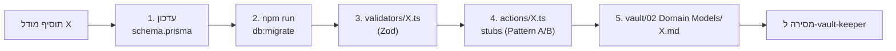

# 🤖 prisma-model-architect

> [!info] קובץ
> `.claude/agents/prisma-model-architect.md`

## תפקיד

End-to-end ownership של מודל חדש: **schema → migration → validator → action stubs → vault note**.

## מתי להפעיל

> [!example] טריגרים
> עברית: "תוסיף מודל...", "טבלה חדשה", "entity חדש"
> אנגלית: "add a Prisma model", "new table", "create entity"

## איך הוא בונה schema

> [!important] חוקי השדה
> - תמיד `id String @id @default(cuid())`
> - תמיד `createdAt DateTime @default(now())` ו-`updatedAt DateTime @updatedAt`
> - אם זה domain entity (לא junction/audit) — `deletedAt DateTime?` ל-[[Soft Delete]]
> - אינדקסים על FKs ועל שדות שיתבקשו בשאילתות (status, dueDate, ...)

## איך הוא בוחר Pattern לאקשנים

> [!info] שאלת מפתח
> *"האם שינויים על המודל הזה צריכים audit log?"*
> - כן (כמו [[Task]]) → [[Server Actions Pattern|Pattern A]] עם events
> - לא (כמו [[Project]], [[Tag]], comment) → Pattern B

## דוגמאות

> [!example] "תוסיף מודל Comment עם body ו-taskId"
> - Comment עם `id`, `body`, `taskId` (FK), `createdAt`, `updatedAt`, `deletedAt`
> - אינדקס על `taskId`
> - validator עם `body` חובה (`'יש להזין הערה'`), max 5000
> - Pattern B — שינוי ב-comment לא מחייב audit log על Task (אבל צריך לכתוב TaskEvent מסוג `COMMENT` כשנוצרת!)
> - הוספה ל-`02 Domain Models/Comment.md`

> [!example] "סטטוס חדש למשימות: BLOCKED"
> זה enum extension, לא מודל חדש — אבל עדיין domain של ה-architect:
> - הוספה ל-`enum TaskStatus { ... BLOCKED }` ב-schema
> - מיגרציה
> - עדכון `TaskStatusEnum` ב-`validators/task.ts`
> - עדכון `STATUS_LABELS` עם תרגום עברית

## מסירה

אחרי סיום — main Claude מפעיל [[vault-keeper]] לפוליש סופי על Architecture.canvas ו-File Map.

ראה גם: [[Subagents]] · [[vault-keeper]] · [[Server Actions Pattern]]
