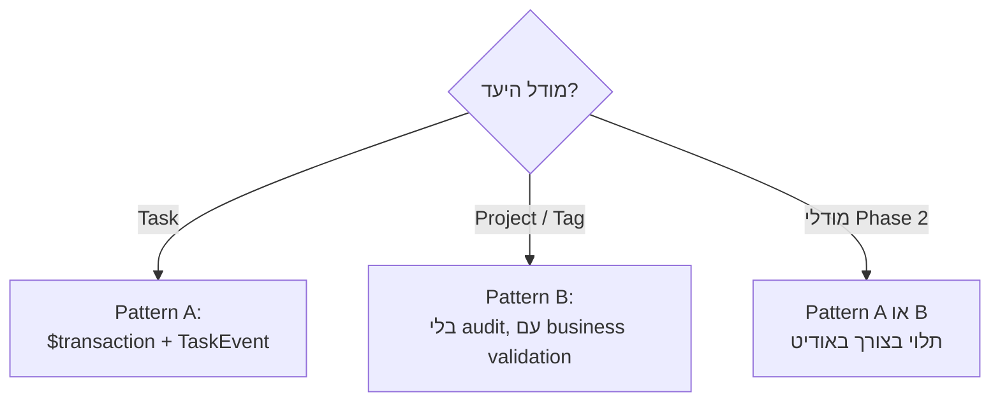

# 🤖 server-action-builder

> [!info] קובץ
> `.claude/agents/server-action-builder.md`

## תפקיד

יוצר או משנה Next.js server action ב-`src/lib/actions/`. שולט בשני ה-[[Server Actions Pattern|patterns]] (Pattern A עם [[TaskEvent]], Pattern B בלי) וב-[[Hebrew Errors|הודעות עברית]], ב-[[Soft Delete]], ובחוזה `revalidatePath`.

## מתי להפעיל

> [!example] טריגרים בעברית
> - "תוסיף action ש..."
> - "תכתוב פעולה..."
> - "אני צריך mutation..."
> - "פעולת שרת..."

> [!example] טריגרים באנגלית
> - "add a server action"
> - "new mutation"
> - "create an action that..."

## איך הוא בוחר Pattern

## דוגמאות שימוש

> [!example] "תוסיף action שדוחה משימה למחר"
> Pattern A — transaction עם `dueDate` update + `UPDATED` TaskEvent (כי `dueDate ∈ LOGGED_FIELDS`). שגיאה בעברית אם המשימה לא נמצאה.

> [!example] "אני צריך פעולה שמעבירה פרויקט לארכיון"
> בודק אם `archiveProject` כבר קיים. אם כן — אולי וריאציה (למשל archive-with-tasks). Pattern B עם business validation.

> [!example] "כפתור שמסמן את כל המשימות בפרויקט כ-DONE"
> Pattern A bulk: transaction עם N updates + N `COMPLETED` events.

## עקרונות שהוא אוכף

1. `'use server'` בראש הקובץ
2. Zod parse של ה-input
3. `where: { deletedAt: null }` בכל read
4. הודעת שגיאה בעברית
5. `revalidatePath('/all')` (ולעיתים גם `/`) לפני return
6. Pattern A: כל write ב-`prisma.$transaction` + יצירת [[TaskEvent]]

ראה גם: [[Subagents]] · [[Server Actions Pattern]] · [[convention-reviewer]]
