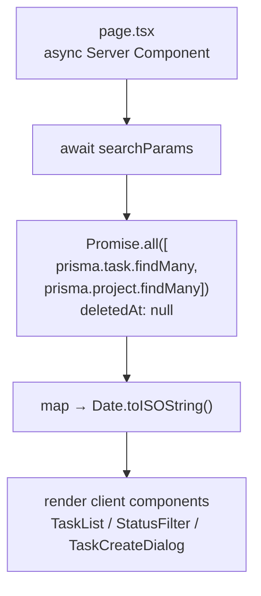

# 🤖 view-builder

> [!info] קובץ
> `.claude/agents/view-builder.md` · model: `sonnet`

## תפקיד

בונה או משנה דף **read-only** ב-`src/app/(views)/` — Server Component אסינכרוני שמושך נתונים מ-Prisma ומרכיב קומפוננטות client קיימות. שולט בתבנית ה-route group `(views)`: קריאות Prisma מקבילות עם פילטר [[Soft Delete]], סריאליזציית `Date`→ISO לפני העברה ל-client, ו-shell עברי RTL.

> [!warning] This is NOT the Next.js you know
> Next.js 16 — `searchParams`/`params` הם **Promise** וחייבים `await`. לפני שינוי routing — לקרוא `node_modules/next/dist/docs/`.

## מתי להפעיל

> [!example] טריגרים בעברית
> - "תבנה את תצוגת..."
> - "תבנה את דף /..."
> - "המסך של היום / השבוע"

> [!example] טריגרים באנגלית
> - "build the today view"
> - "the week page"
> - "add a view for..."

## תבנית הייחוס

> [!info] Reference
> `src/app/(views)/all/page.tsx` — ה-view היחיד שבנוי במלואו. `today` / `week` / `inbox` הם placeholders של Sprint 2 להחלפה. ה-shell (`layout.tsx` → `AppShell`, RTL, Heebo, dark) כבר עוטף כל דף — הסוכן בונה רק את גוף הדף.

## דוגמאות שימוש

> [!example] "תבנה את תצוגת היום — משימות שה-dueDate שלהן היום או באיחור"
> מחליף את ה-placeholder `today/page.tsx` ב-Server Component: `Promise.all` עם פילטר `deletedAt: null`/`archivedAt: null`/`parentTaskId: null` + חלון תאריך, סריאליזציה ל-ISO, render דרך `TaskList`/`StatusFilter`/`TaskCreateDialog` הקיימים. אחרי הסיום — main Claude מפעיל [[vault-keeper]] (view חדש דורש note ב-`vault/03 Views/` + node ב-canvas).

## עקרונות שהוא אוכף

1. **Server Component** — `export default async function`. אין `'use client'` ברמת הדף, אין `useEffect`/`fetch` לנתונים
2. `import { prisma } from '@/lib/db'` — path alias, לעולם לא relative
3. `deletedAt: null` (+`archivedAt: null`/`isArchived: false`) בכל read של Task/Project/Tag
4. **סריאליזציית `Date`** — לעולם לא להעביר אובייקט `Date` ל-client; `.toISOString()` או `null`
5. `await searchParams` / `await params` (Next.js 16)
6. UI בעברית; container `max-w-3xl mx-auto px-6 py-8 space-y-6`
7. מיחזור קומפוננטות client קיימות מ-`@/components/views/` ו-`@/components/tasks/`

## מה הוא לא עושה

- mutations / server actions — [[server-action-builder]]
- schema / migration / validators — [[prisma-model-architect]]
- תיעוד ב-`vault/` — [[vault-keeper]] (main Claude משרשר אחריו)

ראה גם: [[Subagents]] · [[All]] · [[Server Actions Pattern]] · [[vault-keeper]]
