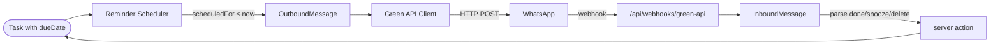

# 🗺️ Roadmap

## Phase 1 — Single User Web (בעבודה)

> [!success] מה כבר עובד
> - 9 מודלי Prisma (כולל מבנה Phase 2 מוכן)
> - 7 server actions ל-[[Task]], 4 ל-[[Project]]
> - [[Audit Log]] מלא דרך [[TaskEvent]]
> - [[Soft Delete]] על Task/Project/Tag
> - [[All]] view מלאה עם status filter
> - RTL + עברית בכל ה-UI ובכל הודעות השרת
> - [[Authentication|Basic Auth]] ב-`proxy.ts`

> [!todo] לסיים ב-Sprint 2
> - [ ] [[Inbox]] view (משימות ללא project וללא due date)
> - [ ] [[Today]] view (`dueDate <= today` ועדיין לא DONE)
> - [ ] [[Week]] view (חלון 7 ימים קדימה)
> - [ ] תפריט Tags ב-sidebar (כרגע "בקרוב")
> - [ ] Sub-tasks (יש `parentTaskId` ב-schema, עדיין לא ב-UI)
> - [ ] Recurrence (יש `recurrenceRule` ב-schema, עדיין לא מיושם)

## Phase 2 — WhatsApp Integration (תכנון)

> [!warning] טרם מומש
> כל מודלי Phase 2 ([[Reminder]], [[OutboundMessage]], [[InboundMessage]]) קיימים ב-schema אבל אין קוד שכותב/קורא מהם. ה-`/api/webhooks/*` עוברים bypass ב-[[Authentication|proxy.ts]] לקראת זה.

### זרימה מתוכננת

### Subagents עתידיים

> [!example] ייכתבו ב-Phase 2
> - **`green-api-integrator`** — לקוח HTTP, webhook handlers, אימות חתימות, פיענוח פקודות (`done`/`snooze`/`delete`)
> - **`reminder-scheduler-designer`** — worker שסורק [[Reminder]] לפי `scheduledFor` ויוצר [[OutboundMessage]]. החלטה פתוחה: Vercel cron / `node-cron` / queue חיצוני

## Phase 3 — Future (רעיוני)

- [ ] Sync ל-Google Calendar
- [ ] PWA + הודעות push בדפדפן (להחליף את WhatsApp במצבים מסוימים)
- [ ] ייצוא ל-CSV / iCal
- [ ] תזכורות חוזרות מבוססות recurrence rules (RRULE)

## נקודות החלטה פתוחות

> [!question] להחליט לפני Phase 2
> 1. Scheduler: Vercel Cron Jobs (פשוט, dependency על Vercel) או worker עצמאי?
> 2. שמירת `rawWebhook` של [[InboundMessage]] — לכמה זמן? (כרגע אין retention policy)
> 3. הודעות failure של Green API — לסמן את ה-[[Reminder]] כ-FAILED ולנסות שוב? כמה ניסיונות?
